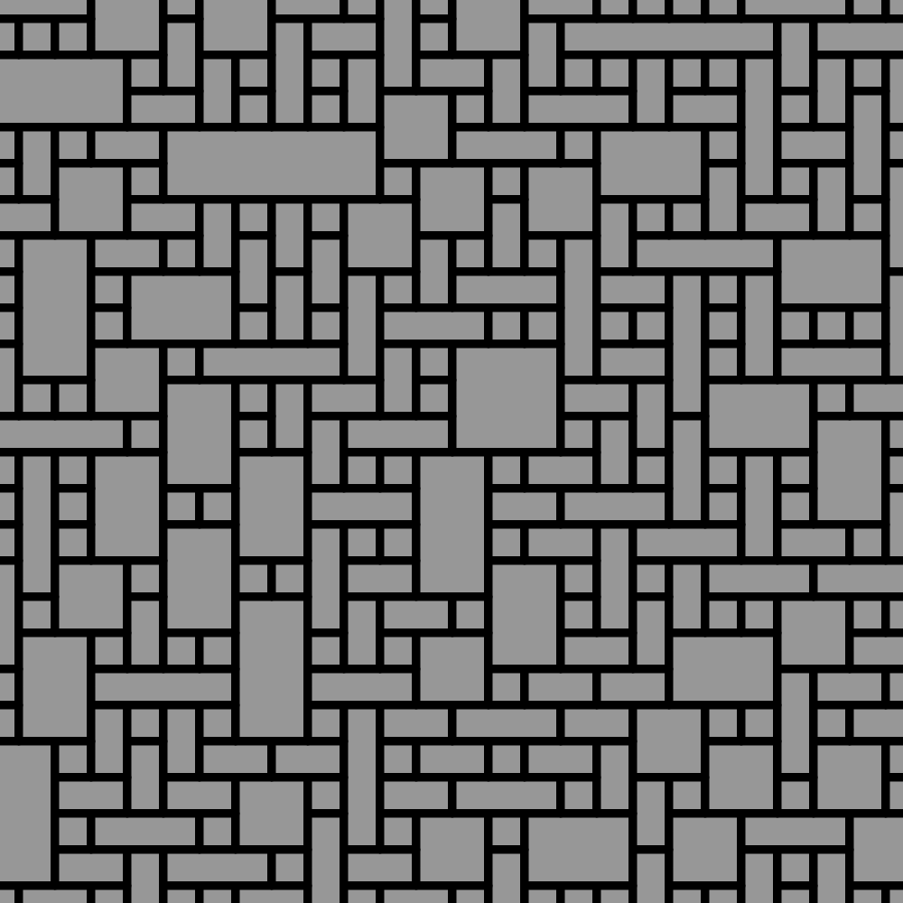

# Fun Projects

This is just a place for me to store personal projects that I have worked on. 
Most of the projects I work on are not my own ideas but they are my own code. I will try to remeber to link where I get the ideas/explination.
This is nothing serious so if you want to use the code go right ahead.

Thanks for checking this out!!

# Sand
- A simple 2D sand simulation using python. Very basic not much to look at.
- There are two simulations one with "gravity" and one without.
- Click and hold to place sand and space to clear the display. Thats it!
- [Insipred by this video by The Coding Train](https://www.youtube.com/watch?v=L4u7Zy_b868)

# Wave Function Collapse
- This is a more involved project, it implements a wave funtion collapse algorithm.
- What I have isn't perfect but I have tried my best to implement what *I* think would be the way to do it.
- There is still a known bug where ocassionally the algorithm creates an unsolvable situation so it cannot generate a block and crashes
- It runs in python so larger grids will take some time to be complete. A grid of 100 takes around 3 minutes to complete.
- There are different tile packs provided but the code uses the demo pack.
- [This awsome video by The Coding Train explains how the algorithm works and he implements it in JS](https://www.youtube.com/watch?v=rI_y2GAlQFM&t=212s)

